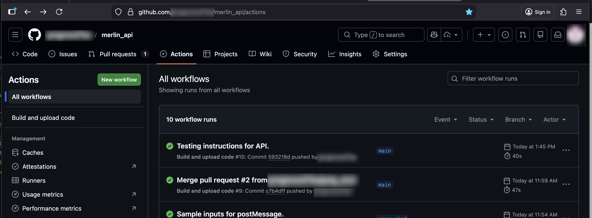
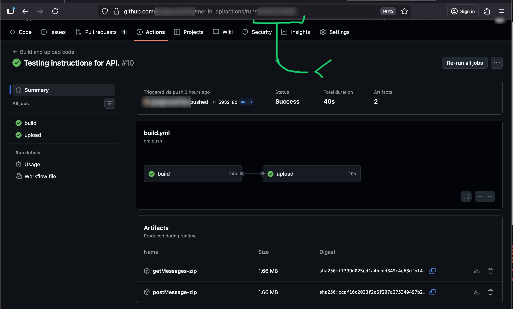
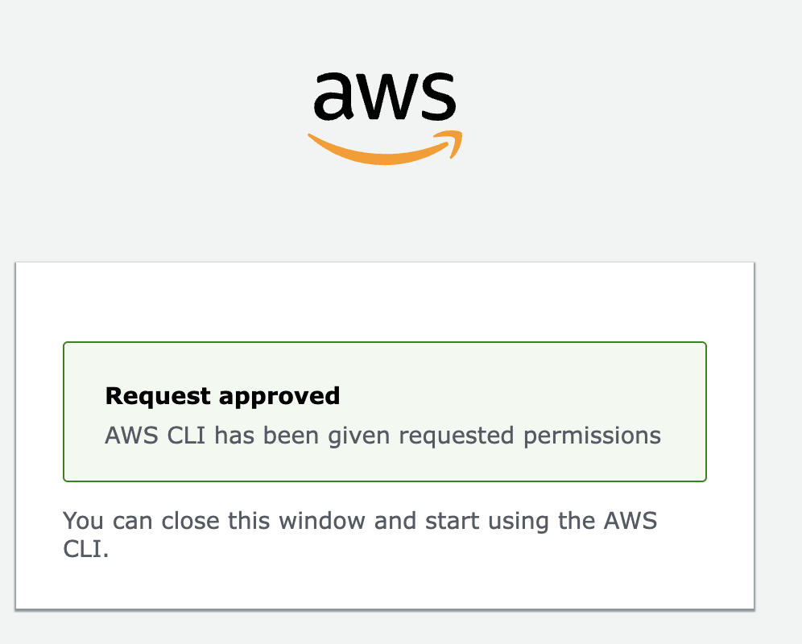
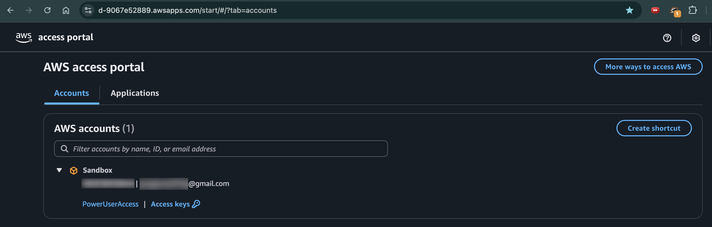
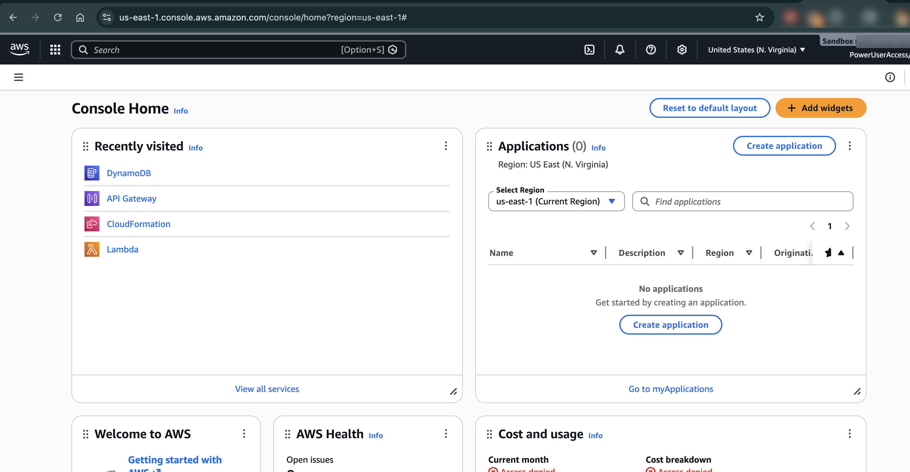
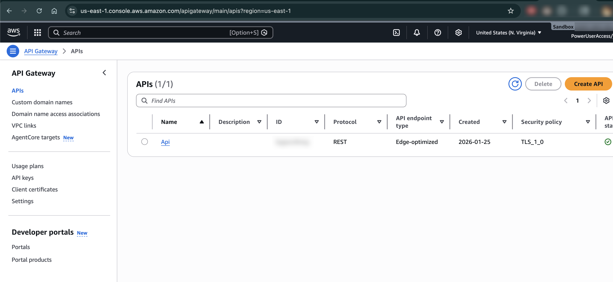
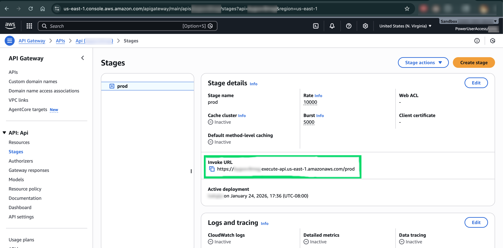

# merlin_agent

AI-powered Dungeon Master for the Merlin game system.

## Overview

This directory contains the AI DM:

**`merlin_dm_service.py`** - Production service that integrates with the Merlin API backend

## Quick Start

### Install Dependencies

```bash
pip install -r requirements.txt
```

### Service Mode (Production)

Run the API-integrated DM service:

```bash
python merlin_dm_service.py \
    --api-url "https://your-api-gateway-url.amazonaws.com" \
    --game-id "game_001" \
    --model "microsoft/Phi-3-mini-4k-instruct" \
    --device mps
```

See [SERVICE_README.md](SERVICE_README.md) for detailed configuration options.

### Testing the API

Use the test client to manually interact with the API:

```bash
python test_api_client.py --api-url "https://your-api-gateway-url.amazonaws.com"
```

## Files

- **`merlin_dm_service.py`** - Main DM service that polls API and generates responses
- **`test_api_client.py`** - Simple API testing client
- **`SERVICE_README.md`** - Detailed service documentation
- **`requirements.txt`** - Python dependencies

## How It Works

The `merlin_dm_service.py` integrates your LLM-based DM with the Merlin API:

1. **Polls** the API for new player messages
2. **Generates** AI responses using your local LLM
3. **Posts** DM responses back to the API
4. **Maintains** conversation history for context

---

## Architecture: merlin_infra and merlin_api
A serverless backend infrastructure on AWS for the AI-based DM (Dungeon Master) app called Merlin.

### 🏗️ merlin_infra - Infrastructure as Code
This uses AWS CDK (Cloud Development Kit) to define and deploy all the AWS resources. The main file is merlin_stack.py, which creates:

1. **DynamoDB Table** (messages)
- **Purpose:** Stores all game messages
- **Structure**:
    - **Partition key**: game (string) - identifies which game session
    - **Sort key**: seq (number) - message sequence number for ordering
  
    Each message includes: id, user info (id & type), and effect (the actual message content)

2. **Two Lambda Functions** (serverless compute)
- **getMessages**: Retrieves messages from a game
- **postMessage**: Adds new messages to a game

3. **API Gateway REST API**
Creates a public HTTP API with the structure:

    - **GET /api/v1/{game}/messages** - fetch messages (with optional start and end query params)
    - **POST /api/v1/{game}/messages** - add a new message
  
4. **S3 Bucket**
Stores the Lambda function code (zip files)


### 📡 merlin_api - The Backend Logic
This contains the actual Python code that runs in the Lambda functions:

- **getMessages Lambda**
Retrieves up to 10 messages from a specific game

    - **Query options**:
        - **No params**: gets the 10 most recent messages
        - **start param**: gets messages after sequence number
        - **end param**: gets messages before sequence number
        - **start & end**: gets messages in that range

    **Returns**: Array of message objects with id, seq, user info, and effect

- **postMessage Lambda**
Adds a new message to a game

  - Queries for the latest message in the game
  - Assigns the next sequence number (seq)
  - Stores the message in DynamoDB
  - Retry logic: Has built-in retry mechanism for concurrent writes
  <br/>
  - **Input format**: Game ID + payload containing message details

### 🔄 How It All Works Together
Web/Agent → API Gateway → Lambda → DynamoDB

Messages are stored with auto-incrementing sequence numbers per game

The API supports pagination/filtering by sequence numbers

Each message has:
 - Unique id (UUID)
 - user info (player/AI identification)
 - effect (the actual message content - like "I cast Fireball!")


### 🚀 Deployment Process

#### Deploy merlin_infra
1. https://github.com/\<name\>/merlin_api/actions

<figure>
  
</figure>

2. Sign in

3. Click the first workflow link
4. Copy the pipeline id from the URL: https://github.com/gregjones07ba/merlin_api/actions/runs/[pipeline id]
<figure>
  
</figure>

5. Place the pipeline id as value of API_VERSION in cdk/cdk/merlin_stack.py
   
6. Commit the file and push it (if the pipeline id has changed)
   
7. Sign in to your aws cli
   - aws sso login
   - authenticate (google authenticator app)
<figure>
  
</figure>
  
8. cd cdk
9. cdk deploy
- log: [output.html](images/cdk_deploy_output.html)

#### Decomission

1. cd cdk
1. cdk destroy
- log: [output.html](images/cdk_destroy_output.html)

# Test

## API

1. Navigate to API Gateway in AWS console
<figure>
  
  <figcaption>aws access portal</figcaption>
</figure>

   - (special url)
   - click PowerUserAccess
  
<figure>
  
  <figcaption>aws power user console</figcaption>
</figure>

  - click Api Gateway
<figure>
  
  <figcaption>aws api gateway console</figcaption>
</figure>


2. Stages

  - Copy Invoke URL

<figure>
  
</figure>


#### POST

1. curl -X POST -H "Content-Type: application/json" -d @"api/payloads/message.json" "[invoke url]/api/v1/1/messages"

#### GET

1. curl [invoke url]/api/v1/1/messages
1. curl "[invoke url]/api/v1/1/messages?start=1&end=3"

## previous version files
under ./local_console_version/

- **`run_instruct_mps_chat7.py`** - Interactive console DM (original development version)
- **`console_app.py`** - Console UI utilities for interactive mode
- **`key_map.py`** - Keyboard shortcuts for interactive mode
